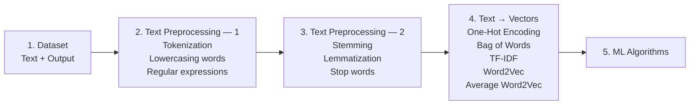

# NLP Text Preprocessing Notes

Personal revision notes for the text-preprocessing exercises in Krish Naik's Udemy Generative AI course. Each notebook focuses on one foundational NLTK technique that is commonly used before feature extraction, classical machine-learning models, or downstream NLP tasks.

## NLP learning roadmap



### Example: sentiment-analysis dataset

| Text | Output |
| --- | ---: |
| The food is good | 1 |
| The food is bad | 0 |
| Pizza is amazing | 1 |
| Burger is bad | 0 |

`1` means positive sentiment and `0` means negative sentiment. The tutorial's workflow moves from this labelled dataset through two preprocessing stages, converts the cleaned text into vectors, and finally passes those vectors to an ML algorithm.

### What to remember

```text
"The food is good"
        ↓ tokenization
["The", "food", "is", "good"]
        ↓ lowercasing / regex cleaning
tokens
        ↓ stemming / lemmatization / stop-word removal
clean tokens
        ↓ one-hot encoding, BoW, TF-IDF, or Word2Vec
numerical vector
        ↓ ML algorithm
positive or negative prediction
```

BoW and TF-IDF count or weight words but do not naturally preserve word order or meaning. Word2Vec represents words as dense vectors, so it captures some semantic similarity; the tutorial uses Gensim for Word2Vec work.

## Notebook roadmap

```text
Raw text
  → tokenization
  → stop-word filtering
  → stemming or lemmatization
  → part-of-speech tagging
  → named-entity recognition
```

| Topic | Notebook | Main NLTK APIs practised | Why it matters |
| --- | --- | --- | --- |
| Tokenization | [tokenization.ipynb](src/text_preprocessing/tokenization.ipynb) | `sent_tokenize`, `word_tokenize`, `wordpunct_tokenize`, `TreebankWordTokenizer` | Converts raw text into sentences and tokens. |
| Stop words | [stopwords.ipynb](src/text_preprocessing/stopwords.ipynb) | `stopwords.words`, `WordNetLemmatizer` | Removes common words with little task-specific meaning. |
| Stemming | [stemming.ipynb](src/text_preprocessing/stemming.ipynb) | `PorterStemmer`, `RegexpStemmer`, `SnowballStemmer` | Reduces related word forms to a stem. |
| Lemmatization | [lemmatization.ipynb](src/text_preprocessing/lemmatization.ipynb) | `WordNetLemmatizer` | Reduces words to meaningful dictionary base forms. |
| POS tagging | [parts_of_speech_tag.ipynb](src/text_preprocessing/parts_of_speech_tag.ipynb) | `pos_tag` | Assigns grammatical roles to tokens. |
| Named-entity recognition | [named_entity_recongnition.ipynb](src/text_preprocessing/named_entity_recongnition.ipynb) | `ne_chunk`, `pos_tag` | Groups tokens that represent entities such as people, organisations, and places. |

## 1. Tokenization

Tokenization breaks a paragraph into units that later NLP steps can process.

- `sent_tokenize(corpus)` splits a paragraph into a list of sentences/documents.
- `word_tokenize(corpus)` splits text into words and punctuation tokens.
- `wordpunct_tokenize(corpus)` uses simpler rules and separates punctuation aggressively.
- `TreebankWordTokenizer()` follows Penn Treebank-style rules, so its punctuation behaviour can differ from `wordpunct_tokenize`.

Remember: tokenizer choice changes the tokens passed downstream. This is especially important for punctuation, contractions, abbreviations, and special characters.

## 2. Stop-word removal

Stop words are very frequent function words such as `the`, `is`, and `and`. The notebook retrieves NLTK's English stop-word list and filters each token before rebuilding cleaned sentences.

```python
words = [
    lemmatizer.lemmatize(word)
    for word in nltk.word_tokenize(sentence)
    if word not in set(stopwords.words("english"))
]
```

- Removing stop words can reduce noise for tasks such as text classification and information retrieval.
- Do not remove them blindly: words like **not** can change sentiment or meaning.
- The notebook compares possible stemming-based approaches and applies lemmatization in the active preprocessing loop.

## 3. Stemming

Stemming strips endings to bring related forms closer together, for example `eating`, `eats`, and `eaten`.

- `PorterStemmer` is a classic English rule-based stemmer.
- `RegexpStemmer('ing$|s$|e$|able$', min=4)` removes endings matched by a custom regular expression.
- `SnowballStemmer("english")` is a more widely used, language-aware stemmer family.

Stems are not guaranteed to be real words. For example, a stemmer may produce a shortened form that is useful for matching but less readable. Compare this with lemmatization when preserving a valid base word matters.

## 4. Lemmatization

Lemmatization maps a word to its dictionary base form. It needs the correct part of speech for the best result.

| POS meaning | WordNet code | Example |
| --- | --- | --- |
| Noun | `n` | `mice` → `mouse` |
| Verb | `v` | `running` → `run` |
| Adjective | `a` | `better` → `good` |
| Adverb | `r` | `fairly` remains `fairly` |

```python
lemmatizer.lemmatize("going", pos="v")
```

Key point: without an appropriate `pos` value, `WordNetLemmatizer` defaults to a noun and may not reduce verbs as expected.

## 5. Part-of-speech tagging

POS tagging labels every token with its grammatical role, such as noun, verb, adjective, or adverb.

The notebook tokenizes each sentence from Dr. A. P. J. Abdul Kalam's speech, removes English stop words, applies Porter stemming, and runs:

```python
nltk.pos_tag(words)
```

This demonstrates a typical pipeline, although stemming before POS tagging can reduce tag accuracy because stems may not be normal words. In production, tag the original tokens first when grammatical accuracy is important.

## 6. Named-entity recognition (NER)

NER identifies spans referring to real-world entities. The notebook processes a sentence about the Eiffel Tower and Gustave Eiffel:

```python
words = nltk.word_tokenize(sentence)
tagged_words = nltk.pos_tag(words)
tree = nltk.ne_chunk(tagged_words)
```

`ne_chunk` requires POS-tagged tokens as input. It returns an NLTK tree containing entity chunks, such as person names or geopolitical locations.

In Jupyter, display `tree` directly to render it inline. Do not call `tree.draw()` in a remote/headless environment: it opens a Tk window and will fail when no `DISPLAY` is available. Install `svgling` when inline tree rendering is unavailable:

```python
%pip install svgling
```

## NLTK data used

Download a resource once in the notebook before using the relevant feature:

```python
import nltk

nltk.download("punkt_tab")
nltk.download("stopwords")
nltk.download("wordnet")
nltk.download("omw-1.4")
nltk.download("averaged_perceptron_tagger_eng")
nltk.download("maxent_ne_chunker_tab")
nltk.download("words")
```

Resource names must be strings. For example, use `nltk.download("maxent_ne_chunker_tab")`, not `nltk.download(maxent_ne_chunker_tab)`.

## Run the notebooks

Install dependencies and start Jupyter Lab:

```bash
poetry install
poetry run jupyter lab --ip=0.0.0.0 --port=8888 --no-browser --ServerApp.token=''
```

Open a notebook in `src/text_preprocessing/` and run its cells in order. The initial NLTK downloads may take a moment on first use.

## Learning source

These exercises follow Krish Naik's Udemy course, *Complete Generative AI Course with LangChain and Hugging Face*.
